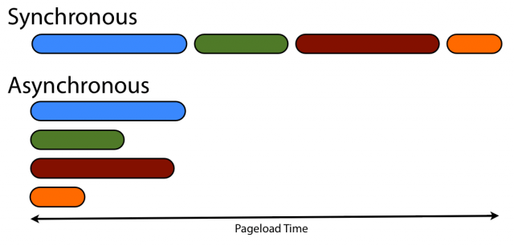

## 简述

## 后期学习目录
thread01：[创建线程](https://lijinhongpassion.github.io/codeant/dxc01.html)
thread02：[线程安全（同步问题）](https://lijinhongpassion.github.io/codeant/dxc02.html)
thread03：[线程状态](https://lijinhongpassion.github.io/codeant/dxc03.html)
thread04：[四种线程池](https://lijinhongpassion.github.io/codeant/dxc04.html)
thread05：[自定义线程池](https://lijinhongpassion.github.io/codeant/dxc05.html)

## 提前了解
#### 1 并发与并行

* **并发**：指两个或多个事件在**同一个时间段内**发生。
* **并行**：指两个或多个事件在**同一时刻**发生（同时发生）。

在操作系统中，安装了多个程序，**并发**指的是在一段时间内宏观上有多个程序同时运行，这在单 CPU 系统中，每一时刻只能有一道程序执行，即微观上这些程序是分时的交替运行，只不过是给人的感觉是同时运行，那是因为分时交替运行的时间是非常短的。

而在多个 CPU 系统中，则**这些可以并发执行的程序便可以分配到多个处理器上（CPU），实现多任务并行执行**，即利用每个处理器来处理一个可以并发执行的程序，这样多个程序便可以同时执行。目前电脑市场上说的多核 CPU，便是多核处理器，核 越多，并行处理的程序越多，能大大的提高电脑运行的效率。

> 注意：单核处理器的计算机肯定是不能并行的处理多个任务的，只能是多个任务在单个CPU上并发运行。同理,线程也是一样的，从宏观角度上理解线程是并行运行的，但是从微观角度上分析却是串行运行的，即一个线程一个线程的去运行，当系统只有一个CPU时，线程会以某种顺序执行多个线程，我们把这种情况称之为线程调度。

#### 2 线程与进程

* **进程**：是指一个内存中运行的应用程序，每个进程都有一个独立的内存空间，一个应用程序可以同时运行多个进程；进程也是程序的一次执行过程，是系统运行程序的基本单位；系统运行一个程序即是一个进程从创建、运行到消亡的过程。

* **线程**：线程是进程中的一个执行单元，负责当前进程中程序的执行，一个进程中至少有一个线程。一个进程中是可以有多个线程的，这个应用程序也可以称之为多线程程序。 

  简而言之：一个程序运行后至少有一个进程，一个进程中可以包含多个线程 

我们可以再电脑底部任务栏，右键----->打开任务管理器,可以查看当前任务的进程：

**进程**

**线程**

**线程调度:**

- 分时调度

  所有线程轮流使用 CPU 的使用权，平均分配每个线程占用 CPU 的时间。

- 抢占式调度

  优先让优先级高的线程使用 CPU，如果线程的优先级相同，那么会随机选择一个(线程随机性)，Java使用的为抢占式调度。

  - 设置线程的优先级

  
  -  抢占式调度详解

    大部分操作系统都支持多进程并发运行，现在的操作系统几乎都支持同时运行多个程序。比如：现在我们上课一边使用编辑器，一边使用录屏软件，同时还开着画图板，dos窗口等软件。此时，这些程序是在同时运行，”感觉这些软件好像在同一时刻运行着“。

    实际上，CPU(中央处理器)使用抢占式调度模式在多个线程间进行着高速的切换。对于CPU的一个核而言，某个时刻，只能执行一个线程，而 CPU的在多个线程间切换速度相对我们的感觉要快，看上去就是在同一时刻运行。
    其实，多线程程序并不能提高程序的运行速度，但能够提高程序运行效率，让CPU的使用率更高。

    
    
#### 3 同步和异步

    
#### 4 同步锁和死锁
**同步锁**
当多个线程同时访问同一个数据时，很容易出现问题。为了避免这种情况出现，我们要保证线程同步互斥，就是指并发执行的多个线程，在同一时间内只允许一个线程访问共享数据。 Java 中可以使用 synchronized 关键字来取得一个对象的同步锁。

**死锁**
何为死锁，就是多个线程同时被阻塞，它们中的一个或者全部都在等待某个资源被释放。

## 参考资料
学习文档\面试\4 JAVA核心面试知识整理.pdf中的多线程部分
学习文档\多线程\黑马程序员-异常 + 多线程基础中的多线程部分