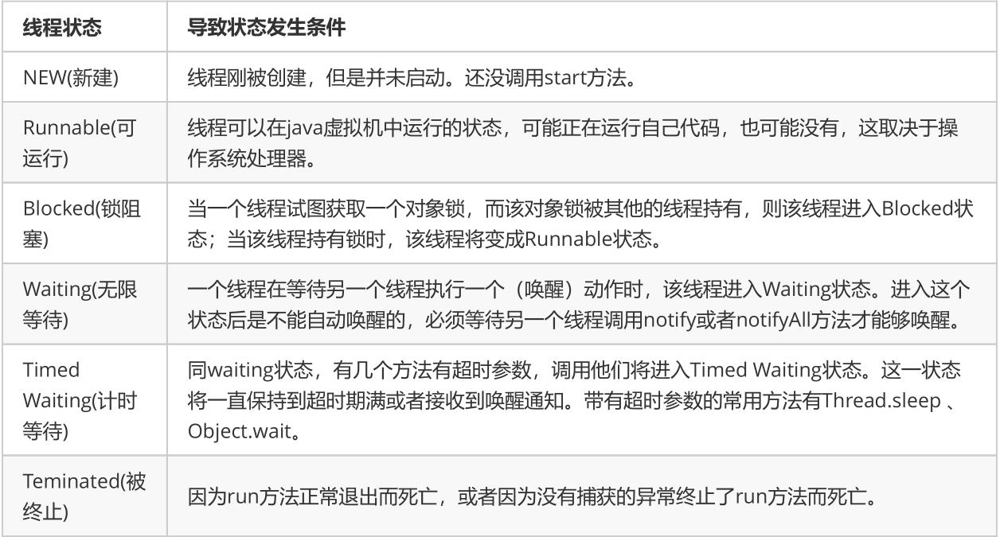
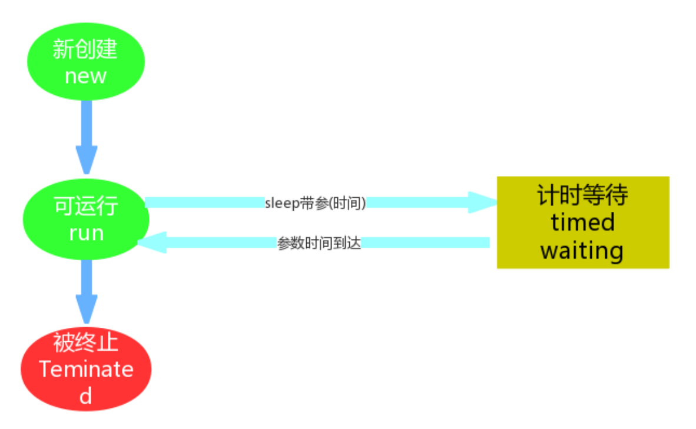
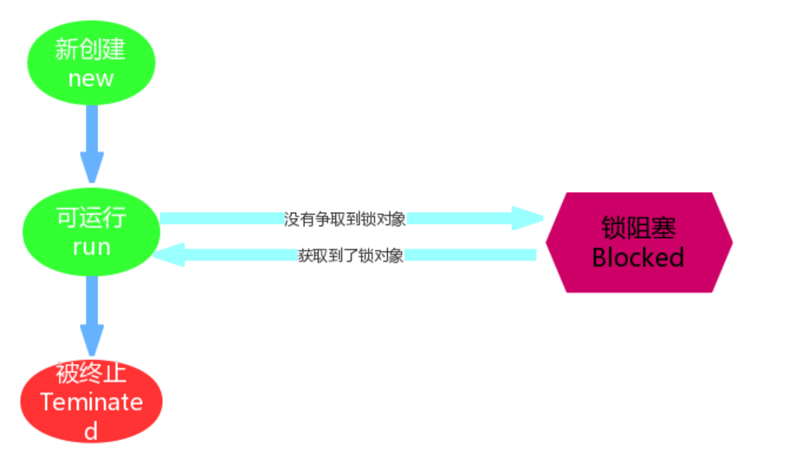
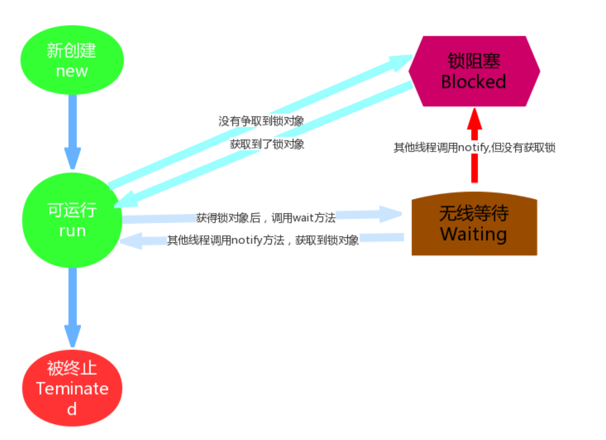
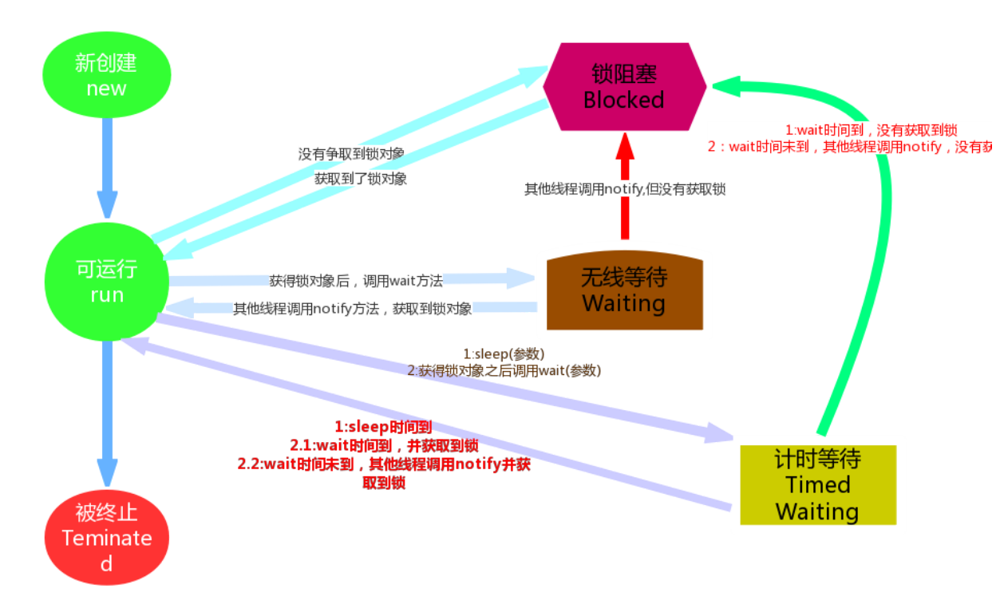

## 简述 - 线程状态
当线程被创建并启动以后，它既不是一启动就进入了执行状态，也不是一直处于执行状态。
在线程的生命周期中，有几种状态呢？在API中 java.lang.Thread.State 这个枚举中给出了六种线程状态：
这里先列出各个线程状态发生的条件，下面将会对每种状态进行详细解析

我们不需要去研究这几种状态的实现原理，我们只需知道在做线程操作中存在这样的状态。那我们怎么去理解这几个状态呢，新建与被终止还是很容易理解的，我们就研究一下线程从Runnable（可运行）状态与非运行状态之间的转换问题。

#### 提前了解 - sleep和wait的区别
1. 对于 sleep()方法，我们首先要知道该方法是属于 Thread 类中的。而 wait()方法，则是属于Object 类中的。
2. sleep()方法导致了程序暂停执行指定的时间，让出 cpu 该其他线程，但是他的监控状态依然保持者，当指定的时间到了又会自动恢复运行状态。
3. 在调用 **sleep()**方法的过程中，线程**不会释放对象锁**。
4. 而当调用** wait()**方法的时候，线程**会放弃对象锁**，进入等待此对象的等待锁定池，只有针对此对象调用 notify()方法后本线程才进入对象锁定池准备获取对象锁进入运行状态。

#### Timed Waiting （计时等待）
Timed Waiting在API中的描述为：一个正在限时等待另一个线程执行一个（唤醒）动作的线程处于这一状态。
单独的去理解这句话，真是玄之又玄，其实我们在之前的操作中已经接触过这个状态了，在哪里呢？在我们写卖票的案例中，为了减少线程执行太快，现象不明显等问题，我们在run方法中添加了sleep语句，这样就强制当前正在执行的线程休眠（暂停执行），以“减慢线程”。其实当我们调用了sleep方法之后，当前执行的线程就进入到“休眠状态”，其实就是所谓的Timed Waiting(计时等待)，那么我们通过一个案例加深对该状态的一个理解。
**实现一个计数器，计数到100，在每个数字之间暂停1秒，每隔10个数字输出一个字符串**
代码：
```java
public class MyThread extends Thread {
    @Override
    public void run() {
        for (int i = 0; i < 100; i++) {
            if ((i) % 10 == 0) {
                System.out.println("‐‐‐‐‐‐‐" + i);
            }
            System.out.print(i);
            try {
                //线程睡眠1秒，超时后自动唤醒
                Thread.sleep(1000);
                System.out.print("    线程睡眠1秒！\n");
            } catch (InterruptedException e) {
                e.printStackTrace();
            }
        }
    }

    public static void main(String[] args) {
        new MyThread().start();
    }
}
```
通过案例可以发现， sleep方法的使用还是很简单的。我们需要记住下面几点：
1. 进入 TIMED_WAITING 状态的一种常见情形是调用的 sleep 方法，单独的线程也可以调用，不一定非要有协
作关系。
2. **为了让其他线程有机会执行**，可以将Thread.sleep()的调用放线程run()之内。这样才能保证该线程执行过程
中会睡眠
3. sleep与锁无关，线程睡眠到期自动苏醒，并返回到Runnable（可运行）状态。
<blockquote >小提示：sleep()中指定的时间是线程不会运行的最短时间。因此，sleep()方法不能保证该线程睡眠到期后就
开始立刻执行。(这里我理解为线程调度的原因，例如时间片调度)</blockquote >

**执行过程**


## BLOCKED （锁阻塞）
Blocked 状态在API中的介绍为：一个正在阻塞等待一个监视器锁（锁对象）的线程处于这一状态。
我们已经学完同步机制，那么这个状态是非常好理解的了。比如，线程A与线程B代码中使用同一锁，如果线程A获取到锁，线程A进入到Runnable状态，那么线程B就进入到Blocked锁阻塞状态。这是由Runnable状态进入Blocked状态。除此Waiting以及Time Waiting状态也会在某种情况下进入阻塞状态，而这部分内容作为扩充知识点带领大家了解一下。

**执行过程**


## Waiting （无限等待）
Wating状态在API中介绍为：一个正在无限期等待另一个线程执行一个特别的（唤醒）动作的线程处于这一状态。
那么我们之前遇到过这种状态吗？答案是并没有。我们通过一段代码来学习一下：
```java
public class MyThread02 {
    public static Object obj = new Object();

    public static void main(String[] args) {
        // 演示waiting
        //name:等待线程
        new Thread(new Runnable() {
            @Override
            public void run() {
//                while (true) {
                    synchronized (obj) {
                        try {
                            System.out.println(Thread.currentThread().getName() + "=== 获取到锁对象，调用wait方法，进入waiting状态，释放锁对象");
                            obj.wait();  //无限等待
                            //obj.wait(5000); //计时等待, 5秒 时间到，自动醒来
                        } catch (InterruptedException e) {
                            e.printStackTrace();
                        }
                        System.out.println(Thread.currentThread().getName() + "=== 继续执行");
                        System.out.println(Thread.currentThread().getName() + "=== 从waiting状态醒来，获取到锁对象，继续执行了");
                    }
//                }
            }
        }, "等待线程").start();

        //name:唤醒线程
        new Thread(new Runnable() {
            @Override
            public void run() {
                //while (true){   //每隔3秒 唤醒一次
                try {
                    System.out.println(Thread.currentThread().getName() + "‐‐‐‐‐ 等待3秒钟");
                    Thread.sleep(3000);
                } catch (InterruptedException e) {
                    e.printStackTrace();
                }
                synchronized (obj) {
                    System.out.println(Thread.currentThread().getName() + "‐‐‐‐‐ 获取到锁对象, 调用notify方法，释放锁对象");
                    obj.notify();
                }
            }
//            }
        }, "唤醒线程").start();

    }
}
```

通过上述案例我们会发现，一个调用了某个对象的 Object.wait 方法的线程会等待另一个线程调用此对象的Object.notify()方法 或 Object.notifyAll()方法。
其实waiting状态并不是一个线程的操作，它体现的是多个线程间的通信，可以理解为多个线程之间的协作关系，多个线程会争取锁，同时相互之间又存在协作关系。就好比在公司里你和你的同事们，你们可能存在晋升时的竞争，但更多时候你们更多是一起合作以完成某些任务。
当多个线程协作时，比如A，B线程，如果A线程在Runnable（可运行）状态中调用了wait()方法那么A线程就进入了Waiting（无限等待）状态，同时失去了同步锁。假如这个时候B线程获取到了同步锁，在运行状态中调用了notify()方法，那么就会将无限等待的A线程唤醒。注意是唤醒，如果获取到锁对象，那么A线程唤醒后就进入Runnable（可运行）状态；如果没有获取锁对象，那么就进入到Blocked（锁阻塞状态）。

**执行过程**


## 扩展



一条有意思的tips:
我们在翻阅API的时候会发现Timed Waiting（计时等待） 与 Waiting（无限等待） 状态联系还是很紧密的，比如Waiting（无限等待） 状态中wait方法是空参的，而timed waiting（计时等待） 中wait方法是带参的。这种带参的方法，其实是一种倒计时操作，相当于我们生活中的小闹钟，我们设定好时间，到时通知，可是如果提前得到（唤醒）通知，那么设定好时间在通知也就显得多此一举了，那么这种设计方案其实是一举两得。如果没有得到（唤醒）通知，那么线程就处于Timed Waiting状态,直到倒计时完毕自动醒来；如果在倒计时期间得到（唤醒）通知，那么线程从Timed Waiting状态立刻唤醒。