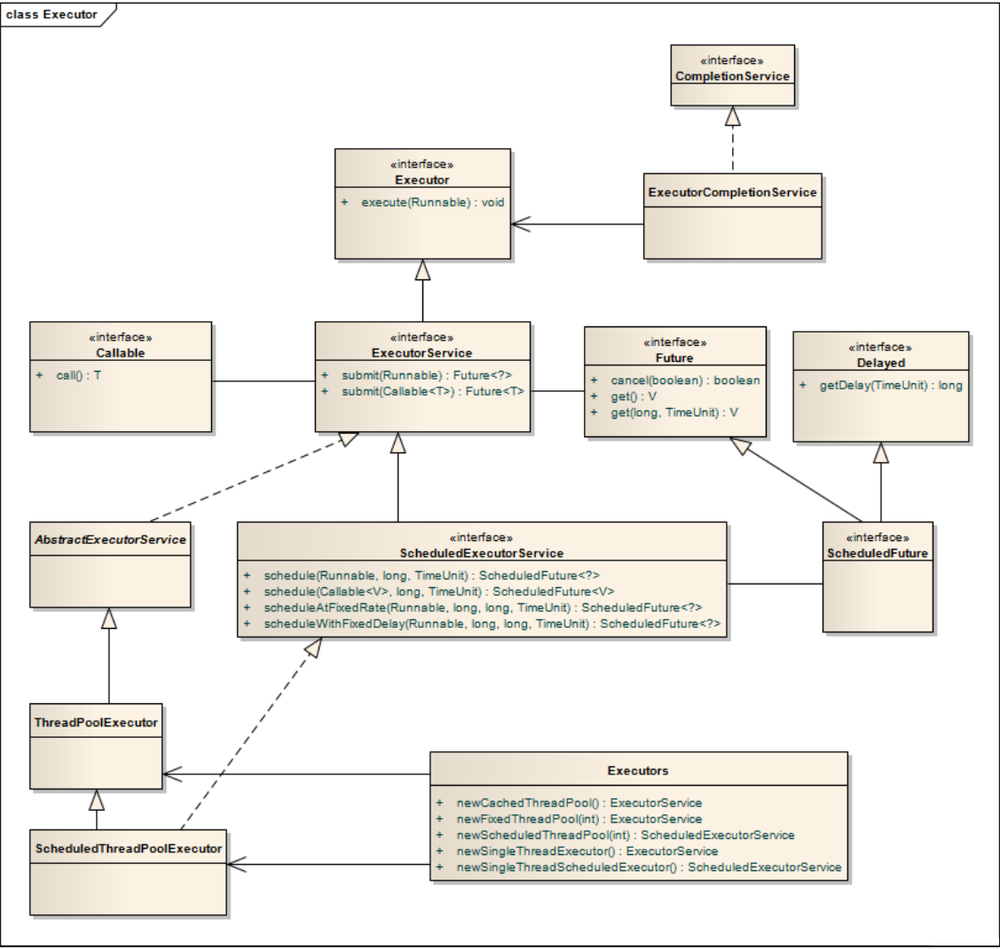

## 简述 - 四种线程池
1. 线程池的概念：

    线程池就是首先创建一些线程，它们的集合称为线程池。使用线程池可以很好地提高性能，线程池在系统启动时即创建大量空闲的线程，程序将一个任务传给线程池，线程池就会启动一条线程来执行这个任务，执行结束以后，该线程并不会死亡，而是再次返回线程池中成为空闲状态，等待执行下一个任务。

2. 线程池的工作机制

    2.1 在线程池的编程模式下，任务是提交给整个线程池，而不是直接提交给某个线程，线程池在拿到任务后，就在内部寻找是否有空闲的线程，如果有，则将任务交给某个空闲的线程。
    
    2.1 一个线程同时只能执行一个任务，但可以同时向一个线程池提交多个任务。

3. **使用线程池的原因：**

    多线程运行时间，系统不断的启动和关闭新线程，成本非常高，会过渡消耗系统资源，以及过渡切换线程的危险，从而可能导致系统资源的崩溃。这时，线程池就是最好的选择了。
    
4. 线程池的组成

    1. 线程池管理器：用于创建并管理线程池
    2. 工作线程：线程池中的线程
    3. 任务接口：每个任务必须实现的接口，用于工作线程调度其运行
    4. 任务队列：用于存放待处理的任务，提供一种缓冲机制
    
---

Java 里面线程池的顶级接口是 Executor，但是严格意义上讲 Executor 并不是一个线程池，而只是一个执行线程的工具。真正的线程池接口是 ExecutorService。
1. 线程池的返回值ExecutorService简介：
    ExecutorService是Java提供的用于管理线程池的类。该类的两个作用：控制线程数量和重用线程
2. 具体的4种常用的线程池：（返回值都是ExecutorService）
     - newCachedThreadPool
     - newFixedThreadPool
     - newScheduledThreadPool
     - newSingleThreadExecutor


---

## newCachedThreadPool
创建一个可根据需要创建新线程的线程池，但是在以前构造的线程可用时将**重用**它们。
对于执行很多短期异步任务的程序而言，这些线程池通常可提高程序性能。**调用 execute 将重用以前构造的线程（如果线程可用）。如果现有线程没有可用的，则创建一个新线程并添加到池中。终止并从缓存中移除那些已有 60 秒钟未被使用的线程。**因此，长时间保持空闲的线程池不会使用任何资源。
```java
public class pool01 {
    public static void main(String[] args) {
        //创建一个可缓存线程池
        ExecutorService cachedThreadPool = Executors.newCachedThreadPool();
        for (int i = 0; i < 10; i++) {
            try {
                //sleep可明显看到使用的是线程池里面以前的线程，没有创建新的线程
                Thread.sleep(1000);
            } catch (InterruptedException e) {
                e.printStackTrace();
            }
            cachedThreadPool.execute(new Runnable() {
                public void run() {
                    //打印正在执行的缓存线程信息
                    System.out.println(Thread.currentThread().getName() + "正在被执行");
                }
            });
        }
        //关闭线程池
        cachedThreadPool.shutdown();
    }
}
```
线程池为无限大，当执行当前任务时上一个任务已经完成，会复用执行上一个任务的线程，而不用每次新建线程

**执行结果**
```text
pool-1-thread-1正在被执行
pool-1-thread-1正在被执行
pool-1-thread-1正在被执行
pool-1-thread-1正在被执行
pool-1-thread-1正在被执行
pool-1-thread-1正在被执行
pool-1-thread-1正在被执行
pool-1-thread-1正在被执行
pool-1-thread-1正在被执行
pool-1-thread-1正在被执行
```

## newFixedThreadPool
创建一个**可重用固定线程数的线程池**，以共享的无界队列方式来运行这些线程。
在任意点，在大多数 nThreads 线程会处于处理任务的活动状态。如果在所有线程处于活动状态时提交附加任务，则在有可用线程之前，附加任务将在队列中等待。如果在关闭前的执行期间由于失败而导致任何线程终止，那么一个新线程将代替它执行后续的任务（如果需要）。在某个线程被显式地关闭之前，池中的线程将一直存在。
```java
public class pool02 {
    public static void main(String[] args) {
        //创建一个可重用固定个数的线程池
        ExecutorService fixedThreadPool = Executors.newFixedThreadPool(3);
        for (int i = 0; i < 10; i++) {
            fixedThreadPool.execute(new Runnable() {
                public void run() {
                    try {
                        //打印正在执行的缓存线程信息
                        System.out.println(Thread.currentThread().getName() + "正在被执行");
                        Thread.sleep(2000);
                    } catch (InterruptedException e) {
                        e.printStackTrace();
                    }
                }
            });
        }
        //关闭线程池
        fixedThreadPool.shutdown();
    }
}

```

因为线程池大小为3，每个任务输出打印结果后sleep 2秒，所以每两秒打印3个结果。
定长线程池的大小最好根据系统资源进行设置。如Runtime.getRuntime().availableProcessors()

**执行结果**
```text
pool-1-thread-1正在被执行
pool-1-thread-2正在被执行
pool-1-thread-3正在被执行
pool-1-thread-1正在被执行
pool-1-thread-3正在被执行
pool-1-thread-2正在被执行
pool-1-thread-1正在被执行
pool-1-thread-3正在被执行
pool-1-thread-2正在被执行
pool-1-thread-1正在被执行
```

## newScheduledThreadPool
创建一个定长线程池，**支持定时及周期性任务执行**
ScheduledExecutorService
- schedule(Runnable, long, TimeUnit) -- 延时执行（只执行一次）
- schedule(Callable<V>, long, TimeUnit) -- 延时执行
- scheduleAtFixedRate(Runnable ,long ,long ,TimeUnit) -- 周期执行
- scheduleWithFixedDelay(Runnable ,long ,long ,TimeUnit) -- 周期执行

```java
public class pool03 {
    public static void main(String[] args) {
        ScheduledExecutorService scheduledThreadPool= Executors.newScheduledThreadPool(3);

        /**
         * 描述：延时执行（只执行一次）
         * @author LJH-1755497577 2019/10/12 13:35
         * @param command 执行线程
         * @param delay 延时
         * @param unit 计时单位
         */
        scheduledThreadPool.schedule(new Runnable(){
            @Override
            public void run() {
                System.out.println("延迟三秒执行");
            }
        }, 3, TimeUnit.SECONDS);

        /**
         * 描述：周期执行
         * @author LJH-1755497577 2019/10/12 13:35
         * @param command 执行线程
         * @param initialDelay 初始化延时
         * @param period 两次开始执行最小间隔时间
         * @param unit 计时单位
         */
        scheduledThreadPool.scheduleAtFixedRate(new Runnable(){
            @Override
            public void run() {
                System.out.println("延迟 1 秒后每三秒执行一次");
            }
        },1,3,TimeUnit.SECONDS);


        /**
         * 描述：周期执行
         * @author LJH-1755497577 2019/10/12 13:35
         * @param command 执行线程
         * @param initialDelay 初始化延时
         * @param period 前一次执行结束到下一次执行开始的间隔时间（间隔执行延迟时间）
         * @param unit 计时单位
         */
        scheduledThreadPool.scheduleWithFixedDelay(new Runnable(){
            @Override
            public void run() {
                System.out.println("延迟 1 秒后每上一个线程执行完成后，间隔3秒，开始下一次线程执行");
            }
        },1,3,TimeUnit.SECONDS);
        
        //关闭线程池
        scheduledThreadPool.shutdown();
    }
}

```

## newSingleThreadExecutor
创建一个单线程化的线程池（这个线程池只有一个线程），它只会用唯一的工作线程来执行任务，保证所有任务按照指定顺序(FIFO, LIFO, 优先级)执行。这个线程池可以在线程死后（或发生异常时）重新启动一个线程来替代原来的线程继续执行下去！
```java
public class pool04 {
    public static void main(String[] args) {
        //创建一个单线程化的线程池
        ExecutorService singleThreadExecutor = Executors.newSingleThreadExecutor();
        for (int i = 0; i < 10; i++) {
            final int index = i;
            singleThreadExecutor.execute(new Runnable() {
                public void run() {
                    try {
                        //结果依次输出，相当于顺序执行各个任务
                        System.out.println(Thread.currentThread().getName() + "正在被执行,打印的值是:" + index);
                        Thread.sleep(1000);
                    } catch (InterruptedException e) {
                        e.printStackTrace();
                    }
                }
            });
        }
        //关闭线程池
        singleThreadExecutor.shutdown();
    }
}
```
**执行结果**
```text
pool-1-thread-1正在被执行,打印的值是:0
pool-1-thread-1正在被执行,打印的值是:1
pool-1-thread-1正在被执行,打印的值是:2
pool-1-thread-1正在被执行,打印的值是:3
pool-1-thread-1正在被执行,打印的值是:4
pool-1-thread-1正在被执行,打印的值是:5
pool-1-thread-1正在被执行,打印的值是:6
pool-1-thread-1正在被执行,打印的值是:7
pool-1-thread-1正在被执行,打印的值是:8
pool-1-thread-1正在被执行,打印的值是:9
```