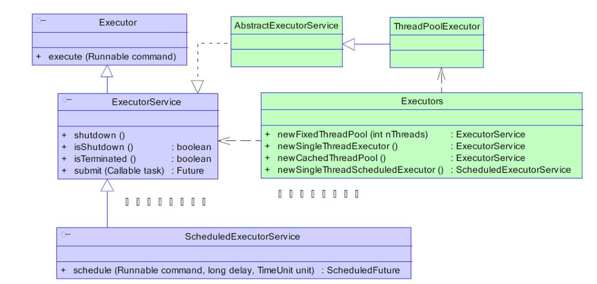
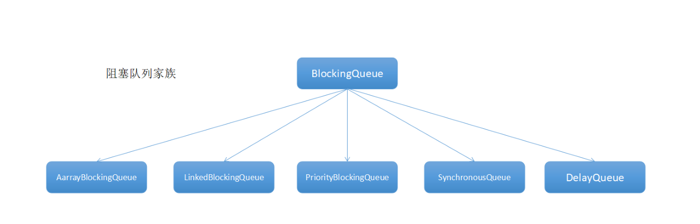
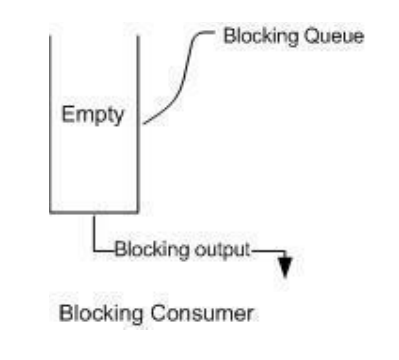
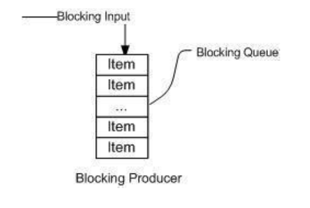

## 简述 - 自定义线程池（注意拒绝策略）
线程池的组成
一般的线程池主要分为以下 4 个组成部分：
    1. 线程池管理器：用于创建并管理线程池
    2. 工作线程：线程池中的线程
    3. 任务接口：每个任务必须实现的接口，用于工作线程调度其运行
    4. 任务队列：用于存放待处理的任务，提供一种缓冲机制
    
---



观察之前提到的四种线程池的获取方法：

```java
public static ExecutorService newCachedThreadPool() {
        return new ThreadPoolExecutor(0, Integer.MAX_VALUE,
                                      60L, TimeUnit.SECONDS,
                                      new SynchronousQueue<Runnable>());
    }
    
public static ExecutorService newFixedThreadPool(int nThreads) {
        return new ThreadPoolExecutor(nThreads, nThreads,
                                      0L, TimeUnit.MILLISECONDS,
                                      new LinkedBlockingQueue<Runnable>());
    }
    
public ThreadPoolExecutor(int corePoolSize,
                              int maximumPoolSize,
                              long keepAliveTime,
                              TimeUnit unit,
                              BlockingQueue<Runnable> workQueue) {
        this(corePoolSize, maximumPoolSize, keepAliveTime, unit, workQueue,
             Executors.defaultThreadFactory(), defaultHandler);
    }
    
public static ExecutorService newSingleThreadExecutor() {
        return new FinalizableDelegatedExecutorService
            (new ThreadPoolExecutor(1, 1,
                                    0L, TimeUnit.MILLISECONDS,
                                    new LinkedBlockingQueue<Runnable>()));
    }
```
**其实最终返回的都是一个ThreadPoolExecutor，那么我们只要返回一个自定义的ThreadPoolExecutor就行了**

## ThreadPoolExecutor的构造函数

```java
public ThreadPoolExecutor(int corePoolSize,
                              int maximumPoolSize,
                              long keepAliveTime,
                              TimeUnit unit,
                              BlockingQueue<Runnable> workQueue,
                              ThreadFactory threadFactory,
                              RejectedExecutionHandler handler) {
        if (corePoolSize < 0 ||
            maximumPoolSize <= 0 ||
            maximumPoolSize < corePoolSize ||
            keepAliveTime < 0)
            throw new IllegalArgumentException();
        if (workQueue == null || threadFactory == null || handler == null)
            throw new NullPointerException();
        this.corePoolSize = corePoolSize;
        this.maximumPoolSize = maximumPoolSize;
        this.workQueue = workQueue;
        this.keepAliveTime = unit.toNanos(keepAliveTime);
        this.threadFactory = threadFactory;
        this.handler = handler;
    }
```
参数解释：
     1. corePoolSize：指定了线程池中的线程数量。
     2. maximumPoolSize：指定了线程池中的最大线程数量。
     3. keepAliveTime：当前线程池数量超过 corePoolSize 时，多余的空闲线程的存活时间，即多次时间内会被销毁。
     4. unit：keepAliveTime 的单位。
     5. workQueue：任务队列，被提交但尚未被执行的任务。
     6. threadFactory：线程工厂，用于创建线程，一般用默认的即可。
     7. handler：拒绝策略，当任务太多来不及处理，如何拒绝任务。

## **自定义线程池MyPool**
```java
public class MyPool extends ThreadPoolExecutor {

    private MyPool(int corePoolSize, int maximumPoolSize, long keepAliveTime, TimeUnit unit, BlockingQueue<Runnable> workQueue, ThreadFactory threadFactory, RejectedExecutionHandler handler) {
        super(corePoolSize, maximumPoolSize, keepAliveTime, unit, workQueue, threadFactory, handler);
    }

    /**
     * 描述:自定义线程池
     *
     * @author LJH-1755497577 2019/10/12 14:55
     * @param corePoolSize 指定了线程池中的线程数量。
     * @param maximumPoolSize 指定了线程池中的最大线程数量
     * @param keepAliveTime 当前线程池数量超过 corePoolSize 时，多余的空闲线程的存活时间，即多次时间内会被销毁。
     * @param unit keepAliveTime 的单位。
     * @param workQueue 任务队列，被提交但尚未被执行的任务。
     * @param threadFactory 线程工厂，用于创建线程，一般用默认的即可。
     * @param handler 拒绝策略，当任务太多来不及处理，如何拒绝任务。
     * @return java.util.concurrent.ThreadPoolExecutor
     */
    public static ThreadPoolExecutor getInstance(int corePoolSize,
                                                 int maximumPoolSize,
                                                 long keepAliveTime,
                                                 TimeUnit unit,
                                                 BlockingQueue<Runnable> workQueue,
                                                 ThreadFactory threadFactory,
                                                 RejectedExecutionHandler handler){
        return new MyPool( corePoolSize,  maximumPoolSize,  keepAliveTime,
                unit,  workQueue, threadFactory, handler);
    }
}
```
**测试类**
```java
public class Main {
    public static void main(String[] args) {
        ExecutorService poolExecutor = MyPool.getInstance(0, Integer.MAX_VALUE,
                60L, TimeUnit.SECONDS,
                new SynchronousQueue<Runnable>(), Executors.defaultThreadFactory(),
                new ThreadPoolExecutor.AbortPolicy());

        for(int a = 0; a < 10; a++){
            poolExecutor.execute(new Runnable() {
                @Override
                public void run() {
                    System.out.println(Thread.currentThread().getName()  + "-----自定义线程池执行");
                }
            });
        }

        poolExecutor.shutdown();
    }
}
```
## 重要参数讲解
#### RejectedExecutionHandler handler：拒绝策略
线程池中的线程已经用完了，无法继续为新任务服务，同时，等待队列也已经排满了，再也塞不下新任务了。这时候我们就需要拒绝策略机制合理的处理这个问题。
JDK 内置的拒绝策略如下：
    1. AbortPolicy ： 直接抛出异常，阻止系统正常运行。
    2. CallerRunsPolicy ： 只要线程池未关闭，该策略直接在调用者线程中，运行当前被丢弃的任务。显然这样做不会真的丢弃任务，但是，任务提交线程的性能极有可能会急剧下降。
    3. DiscardOldestPolicy ： 丢弃最老的一个请求，也就是即将被执行的一个任务，并尝试再次提交当前任务。
    4. DiscardPolicy ： 该策略默默地丢弃无法处理的任务，不予任何处理。如果允许任务丢失，这是最好的一种方案。
以上内置拒绝策略均实现了 RejectedExecutionHandler 接口，若以上策略仍无法满足实际需要，完全可以自己扩展 RejectedExecutionHandler 接口。

**注意**：之前的四种拒绝策略的默认为new AbortPolicy();

#### BlockingQueue<Runnable> workQueue：任务阻塞队列
    1. ArrayBlockingQueue ：由数组结构组成的有界阻塞队列。
    2. LinkedBlockingQueue ：由链表结构组成的有界阻塞队列。
    3. PriorityBlockingQueue ：支持优先级排序的无界阻塞队列。
    4. DelayQueue：使用优先级队列实现的无界阻塞队列。
    5. SynchronousQueue：不存储元素的阻塞队列。
    6. LinkedTransferQueue：由链表结构组成的无界阻塞队列。
    7. LinkedBlockingDeque：由链表结构组成的双向阻塞队列


阻塞队列，关键字是阻塞，先理解阻塞的含义，在阻塞队列中，线程阻塞有这样的两种情况
1. 当队列中没有数据的情况下，消费者端的所有线程都会被自动阻塞（挂起），直到有数据放
入队列。

2. 当队列中填满数据的情况下，生产者端的所有线程都会被自动阻塞（挂起），直到队列中有
空的位置，线程被自动唤醒。
